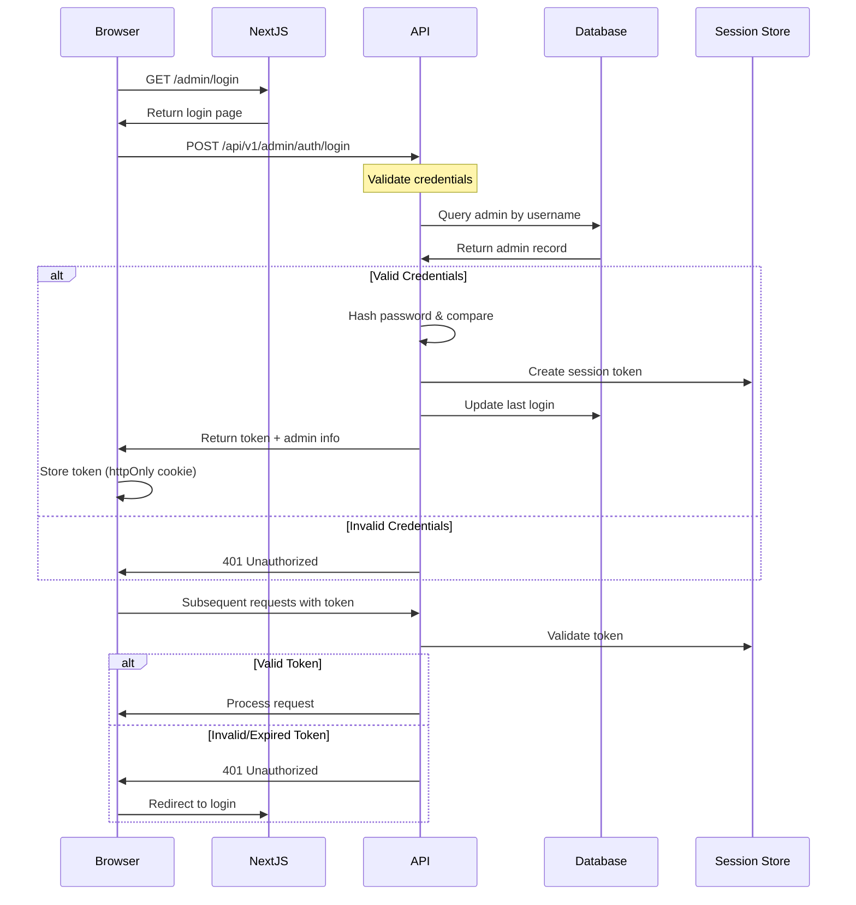

# Security Architecture - Claude AWS Account Marketplace

## Overview
This document outlines the security measures, authentication flow, and data protection strategies for the Claude AWS Account Marketplace.

## Security Principles

1. **Defense in Depth**: Multiple layers of security controls
2. **Principle of Least Privilege**: Minimal access rights for operations
3. **Zero Trust**: Verify everything, trust nothing
4. **Data Encryption**: Protect sensitive data at rest and in transit
5. **Security by Design**: Built-in security, not bolted-on

## Authentication Flow

### Admin Authentication



### Session Management

```typescript
// Session Configuration
interface SessionConfig {
  tokenLength: 32;              // bytes
  expirationTime: 24 * 60 * 60; // 24 hours in seconds
  refreshThreshold: 60 * 60;     // 1 hour before expiry
  maxSessions: 5;                // Per admin user
}

// Session Token Structure
interface SessionToken {
  id: string;                    // Session ID
  adminId: string;              // Admin user ID
  token: string;                // Secure random token
  expiresAt: Date;              // Expiration timestamp
  createdAt: Date;              // Creation timestamp
  userAgent?: string;           // Browser info
  ipAddress?: string;           // Client IP
}
```

## Data Protection

### Encryption Strategy

#### At Rest
```typescript
// AWS Credentials Encryption
class CredentialEncryption {
  private algorithm = 'aes-256-gcm';
  private keyDerivation = 'pbkdf2';
  
  async encryptCredentials(accessKey: string, secretKey: string): Promise<{
    encryptedAccess: string;
    encryptedSecret: string;
    iv: string;
    salt: string;
  }> {
    // Implementation using Node.js crypto
  }
  
  async decryptCredentials(encrypted: EncryptedCredentials): Promise<{
    accessKey: string;
    secretKey: string;
  }> {
    // Implementation with proper error handling
  }
}
```

#### In Transit
- **HTTPS Only**: Enforce SSL/TLS for all connections
- **HSTS Header**: Strict-Transport-Security with preload
- **Certificate Pinning**: For critical API endpoints

### Environment Variables

```bash
# .env.local (Development)
DATABASE_URL="postgresql://..."
DIRECT_URL="postgresql://..."
NEXTAUTH_SECRET="random-32-byte-string"
ENCRYPTION_KEY="base64-encoded-32-byte-key"
ADMIN_USERNAME="admin"
ADMIN_PASSWORD_HASH="bcrypt-hash"

# Production (Vercel Environment Variables)
# All sensitive values stored in Vercel dashboard
# No secrets in codebase
```

## Security Headers

```typescript
// middleware.ts
export function middleware(request: NextRequest) {
  const response = NextResponse.next();
  
  // Security Headers
  response.headers.set('X-Content-Type-Options', 'nosniff');
  response.headers.set('X-Frame-Options', 'DENY');
  response.headers.set('X-XSS-Protection', '1; mode=block');
  response.headers.set('Referrer-Policy', 'strict-origin-when-cross-origin');
  response.headers.set('Permissions-Policy', 'camera=(), microphone=(), geolocation=()');
  
  // HSTS
  response.headers.set(
    'Strict-Transport-Security',
    'max-age=31536000; includeSubDomains; preload'
  );
  
  // CSP
  response.headers.set(
    'Content-Security-Policy',
    "default-src 'self'; " +
    "script-src 'self' 'unsafe-inline' 'unsafe-eval' https://vercel.live; " +
    "style-src 'self' 'unsafe-inline'; " +
    "img-src 'self' data: https:; " +
    "font-src 'self'; " +
    "connect-src 'self' https://api.telegram.org; " +
    "frame-ancestors 'none';"
  );
  
  return response;
}
```

## API Security

### Rate Limiting

```typescript
// lib/rateLimiter.ts
interface RateLimitConfig {
  windowMs: number;           // Time window in milliseconds
  maxRequests: number;        // Max requests per window
  keyGenerator: (req: Request) => string;
}

const rateLimits = {
  // Public endpoints
  publicApi: {
    windowMs: 60 * 1000,      // 1 minute
    maxRequests: 60,          // 60 requests per minute
  },
  
  // Auth endpoints
  login: {
    windowMs: 15 * 60 * 1000, // 15 minutes
    maxRequests: 5,           // 5 attempts per 15 minutes
  },
  
  // Admin endpoints
  adminApi: {
    windowMs: 60 * 1000,      // 1 minute
    maxRequests: 120,         // 120 requests per minute
  },
  
  // Quota refresh (expensive operation)
  quotaRefresh: {
    windowMs: 60 * 60 * 1000, // 1 hour
    maxRequests: 10,          // 10 refreshes per hour
  }
};
```

### Input Validation

```typescript
// lib/validation/schemas.ts
import { z } from 'zod';

// Login validation
export const loginSchema = z.object({
  username: z.string()
    .min(3)
    .max(50)
    .regex(/^[a-zA-Z0-9_-]+$/),
  password: z.string()
    .min(8)
    .max(100)
});

// Account creation validation
export const createAccountSchema = z.object({
  name: z.string()
    .min(3)
    .max(50)
    .regex(/^[a-zA-Z0-9-_]+$/),
  displayName: z.string()
    .min(3)
    .max(100),
  awsAccessKey: z.string()
    .regex(/^AKIA[0-9A-Z]{16}$/),
  awsSecretKey: z.string()
    .length(40),
  price: z.object({
    amount: z.number().min(0).max(999999),
    currency: z.enum(['USD', 'CNY'])
  }),
  instructions: z.string().max(5000),
  features: z.array(z.string()).max(20),
  limitations: z.array(z.string()).max(20)
});

// SQL Injection Prevention (using Prisma ORM)
// All queries use parameterized statements
```

### CORS Configuration

```typescript
// next.config.js
module.exports = {
  async headers() {
    return [
      {
        source: '/api/:path*',
        headers: [
          {
            key: 'Access-Control-Allow-Origin',
            value: process.env.NODE_ENV === 'production' 
              ? 'https://claude-accounts.com'
              : 'http://localhost:3000'
          },
          {
            key: 'Access-Control-Allow-Methods',
            value: 'GET, POST, PUT, DELETE, OPTIONS'
          },
          {
            key: 'Access-Control-Allow-Headers',
            value: 'Content-Type, Authorization'
          },
          {
            key: 'Access-Control-Max-Age',
            value: '86400'
          }
        ]
      }
    ];
  }
};
```

## Access Control

### Route Protection

```typescript
// middleware.ts
const protectedRoutes = [
  '/admin',
  '/api/v1/admin'
];

export async function middleware(request: NextRequest) {
  const path = request.nextUrl.pathname;
  
  // Check if route is protected
  if (protectedRoutes.some(route => path.startsWith(route))) {
    const token = request.cookies.get('session-token');
    
    if (!token) {
      // Redirect to login for web routes
      if (!path.startsWith('/api')) {
        return NextResponse.redirect(new URL('/admin/login', request.url));
      }
      // Return 401 for API routes
      return new NextResponse(
        JSON.stringify({ error: 'Unauthorized' }),
        { status: 401, headers: { 'Content-Type': 'application/json' } }
      );
    }
    
    // Validate token
    const isValid = await validateSessionToken(token.value);
    if (!isValid) {
      // Clear invalid cookie
      const response = NextResponse.redirect(new URL('/admin/login', request.url));
      response.cookies.delete('session-token');
      return response;
    }
  }
  
  return NextResponse.next();
}
```

### API Authorization

```typescript
// lib/auth/authorize.ts
export async function authorizeAdmin(request: Request): Promise<Admin | null> {
  const token = extractToken(request);
  if (!token) return null;
  
  const session = await getSession(token);
  if (!session || session.expiresAt < new Date()) {
    return null;
  }
  
  const admin = await getAdmin(session.adminId);
  if (!admin || !admin.isActive) {
    return null;
  }
  
  // Extend session if close to expiry
  if (shouldRefreshSession(session)) {
    await extendSession(session.id);
  }
  
  return admin;
}
```

## Security Monitoring

### Audit Logging

```typescript
// All security-relevant events are logged
enum SecurityEvents {
  // Authentication
  LOGIN_SUCCESS = 'LOGIN_SUCCESS',
  LOGIN_FAILED = 'LOGIN_FAILED',
  LOGOUT = 'LOGOUT',
  SESSION_EXPIRED = 'SESSION_EXPIRED',
  
  // Data Access
  CREDENTIALS_ACCESSED = 'CREDENTIALS_ACCESSED',
  CREDENTIALS_UPDATED = 'CREDENTIALS_UPDATED',
  
  // Admin Actions
  ACCOUNT_CREATED = 'ACCOUNT_CREATED',
  ACCOUNT_DELETED = 'ACCOUNT_DELETED',
  PRICE_CHANGED = 'PRICE_CHANGED',
  
  // Security Events
  RATE_LIMIT_EXCEEDED = 'RATE_LIMIT_EXCEEDED',
  INVALID_TOKEN = 'INVALID_TOKEN',
  SUSPICIOUS_ACTIVITY = 'SUSPICIOUS_ACTIVITY'
}

// Audit log includes: timestamp, event, adminId, IP, userAgent, metadata
```

### Monitoring Alerts

```typescript
// Alert conditions
interface SecurityAlert {
  // Failed login attempts
  multipleFailedLogins: {
    threshold: 5,
    window: '15 minutes',
    action: 'block IP for 1 hour'
  },
  
  // Unusual access patterns
  unusualAccessTime: {
    normalHours: '08:00-22:00',
    action: 'notify admin'
  },
  
  // Rate limit violations
  rateLimitViolations: {
    threshold: 10,
    window: '1 hour',
    action: 'investigate source'
  },
  
  // Credential access
  frequentCredentialAccess: {
    threshold: 20,
    window: '1 hour',
    action: 'review activity'
  }
}
```

## External Integration Security

### Python Script Integration

```typescript
// Secure execution of quota check script
class QuotaScriptExecutor {
  private readonly scriptPath = process.env.QUOTA_SCRIPT_PATH;
  private readonly timeout = 30000; // 30 seconds
  
  async executeQuotaCheck(accountId: string): Promise<QuotaResult> {
    // Validate input
    if (!isValidAccountId(accountId)) {
      throw new Error('Invalid account ID');
    }
    
    // Get encrypted credentials
    const account = await getAccount(accountId);
    const credentials = await decryptCredentials(account);
    
    // Execute in sandboxed environment
    const result = await executeWithTimeout(
      this.runScript(credentials),
      this.timeout
    );
    
    // Clean up sensitive data
    cleanupTempFiles();
    
    // Audit log the access
    await logCredentialAccess(accountId, 'QUOTA_CHECK');
    
    return result;
  }
}
```

### Telegram Integration

```typescript
// Secure Telegram link generation
export function generateTelegramLink(accountName: string): string {
  // Sanitize account name
  const sanitized = encodeURIComponent(accountName.slice(0, 100));
  
  // Use environment variable for username
  const telegramUsername = process.env.TELEGRAM_USERNAME;
  
  // Generate message
  const message = encodeURIComponent(
    `Hi, I'm interested in purchasing the account: ${sanitized}`
  );
  
  return `https://t.me/${telegramUsername}?text=${message}`;
}
```

## Security Checklist

### Pre-Deployment
- [ ] All environment variables configured in Vercel
- [ ] HTTPS enforced on all routes
- [ ] Security headers configured
- [ ] Rate limiting implemented
- [ ] Input validation on all endpoints
- [ ] Admin credentials properly hashed
- [ ] Encryption keys securely generated
- [ ] Database connection using SSL

### Post-Deployment
- [ ] Security scan with OWASP ZAP
- [ ] Dependency vulnerability check
- [ ] SSL certificate validation
- [ ] Penetration testing
- [ ] Security monitoring active
- [ ] Backup and recovery tested
- [ ] Incident response plan ready
- [ ] Security documentation complete